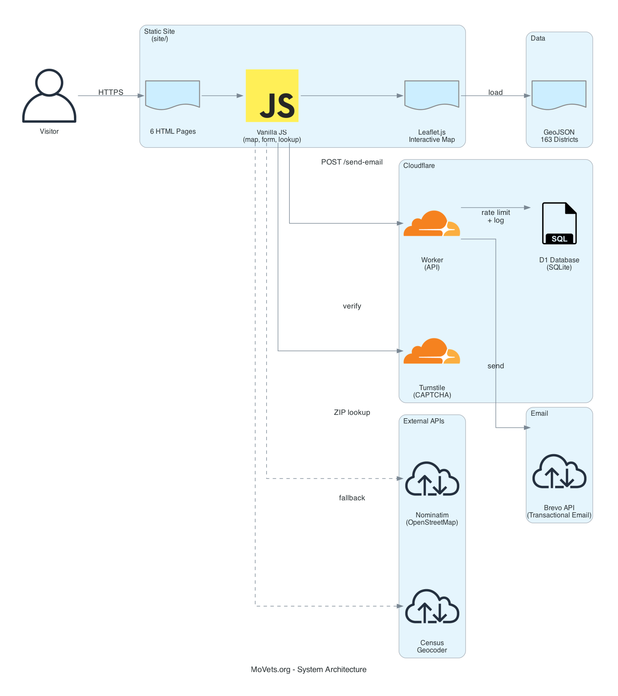
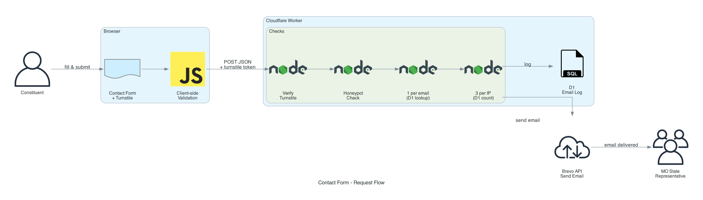
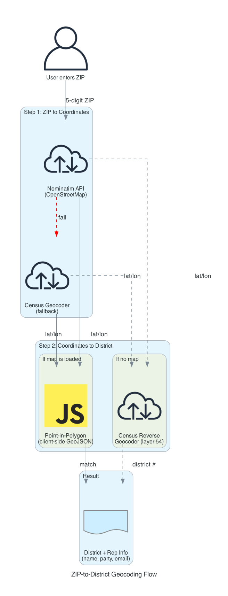
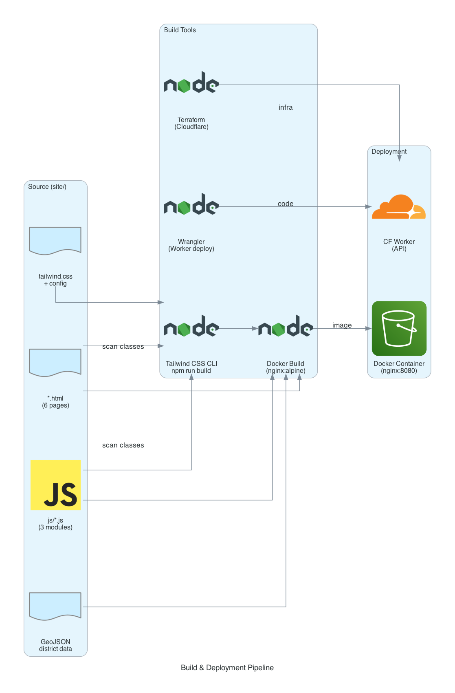

# MoVets.org Architecture Overview

MoVets.org is a static advocacy website for Missouri HB2089 (veteran property tax relief). It pairs a multi-page static frontend hosted on Cloudflare Pages with a Cloudflare Workers serverless backend for constituent-to-representative email delivery via Brevo.

## System Architecture



### Components

| Layer | Technology | Purpose |
|-------|-----------|---------|
| **Frontend** | HTML, Tailwind CSS, Vanilla JS | 6 static pages with interactive map and contact form |
| **Map** | Leaflet.js + GeoJSON | 163 Missouri House district boundaries with rep data |
| **Geocoding** | Nominatim + Census APIs | ZIP code to district/representative lookup |
| **Backend** | Cloudflare Workers | Email submission handler (serverless) |
| **Database** | Cloudflare D1 (SQLite) | Email logging, rate limiting, duplicate prevention |
| **Email** | Brevo API | Delivers constituent messages to state reps (free: 300/day) |
| **CAPTCHA** | Cloudflare Turnstile | Bot prevention (free, privacy-friendly) |
| **Hosting** | Cloudflare Pages | Static site with global CDN (auto-deploys from GitHub) |
| **Analytics** | Cloudflare Web Analytics | Privacy-friendly, no cookies, GDPR-compliant |
| **Infrastructure** | Terraform (Cloudflare provider) | Infrastructure as Code |

### Design Principles

- **No frameworks** — vanilla HTML/CSS/JS, no build-time rendering
- **No client-side API keys** — Brevo key is server-side only (Worker env)
- **No paid services** — Cloudflare free tier + Brevo free tier
- **Serverless backend** — zero cost at rest, scales automatically
- **SQLite-backed limits** — persistent rate limiting across Worker restarts
- **SEO complete** — OG tags, Twitter cards, canonical URLs, JSON-LD, sitemap, robots.txt
- **Privacy-first analytics** — Cloudflare Web Analytics, no cookies, no consent banner needed

---

## Contact Form Request Flow



### Step-by-step

1. **User fills form** — name, email, ZIP, message + completes Turnstile challenge
2. **Client-side validation** — required fields, email format, ZIP format, Turnstile token present
3. **POST to Cloudflare Worker** — JSON payload with constituent info + Turnstile token
4. **Worker processing pipeline:**
   - **Verify Turnstile** — POST token to `challenges.cloudflare.com/turnstile/v0/siteverify`
   - **Honeypot check** — hidden `website` field must be empty
   - **Email uniqueness** — D1 query: has this email already sent? (1 per email, lifetime)
   - **IP rate limit** — D1 query: count emails from this IP (max 3 per IP, lifetime)
   - **Sanitize** — strip `<>`, trim whitespace, cap at 5,000 chars
5. **Brevo sends email** — from `noreply@movets.org`, reply-to set to constituent's email
6. **D1 logs** — sender, rep, district, message type, IP, timestamp
7. **Response** — 200 success, 400 validation/captcha/duplicate, 429 rate limited, 500 error

### Email Format

```
Subject: HB2089 Support: Message from {name}, {zip}

Dear Representative {rep_name},

My name is {name} and I am a constituent in District {district} (ZIP: {zip}).

{user_message}

Sincerely,
{name}
{email}

---
Sent via MoVets.org — Non-partisan veteran advocacy for HB2089
```

### Security Measures

| Measure | How |
|---------|-----|
| Turnstile CAPTCHA | Server-side token verification (bot prevention) |
| Honeypot field | Hidden form field (simple bot trap) |
| Email uniqueness | D1 UNIQUE constraint on `sender_email` (1 per sender) |
| IP rate limit | Max 4 emails per IP (D1 count query) |
| US geo-block | `request.cf.country` must be `US` |
| Rep email validation | Must match `@house.mo.gov` domain |
| Request size limit | 10KB max POST body |
| Input sanitization | HTML tag stripping, 5000 char cap |
| CORS | Restricted to `https://movets.org` |
| No client secrets | Brevo API key is Worker-side only |

---

## D1 Database Schema

```sql
CREATE TABLE emails (
  id INTEGER PRIMARY KEY AUTOINCREMENT,
  sender_email TEXT NOT NULL UNIQUE,    -- enforces 1 per sender
  sender_name TEXT NOT NULL,
  sender_zip TEXT NOT NULL,
  rep_email TEXT NOT NULL,
  rep_name TEXT,
  district TEXT,
  message_type INTEGER DEFAULT 1,      -- 1=support, 2=support+revisions
  ip_address TEXT NOT NULL,
  created_at TEXT DEFAULT (datetime('now'))
);

CREATE INDEX idx_ip ON emails(ip_address);  -- fast IP count queries

CREATE TABLE subscribers (
  id INTEGER PRIMARY KEY AUTOINCREMENT,
  email TEXT NOT NULL UNIQUE,
  subscribed_at TEXT DEFAULT (datetime('now')),
  unsubscribed_at TEXT
);
```

---

## Newsletter System

### Subscription flow

1. User enters email in footer subscribe form (present on all 6 pages)
2. `subscribe.js` POSTs `{ email }` to Worker `/subscribe` endpoint
3. Worker validates email, normalizes to lowercase, inserts into `subscribers` table
4. Duplicate subscriptions silently succeed (no information leak)

### Sending a newsletter

```bash
node scripts/send-newsletter.js --subject "Title" --content content.html [--dry-run]
```

1. Script queries D1 for all active subscribers (`unsubscribed_at IS NULL`)
2. Reads `scripts/newsletter-template.html` and injects content + subject
3. Sends individually via Brevo API (100ms delay between sends)
4. `--dry-run` lists recipients and saves preview to `/tmp/newsletter-preview.html`

### Worker endpoints

| Endpoint | Method | Purpose |
|----------|--------|---------|
| `/send-email` | POST | Contact form → representative email |
| `/subscribe` | POST | Newsletter subscription |

---

## ZIP-to-District Geocoding Flow



### Two-step resolution

**Step 1 — ZIP to coordinates:**

| Priority | API | Endpoint | Auth |
|----------|-----|----------|------|
| Primary | Nominatim (OpenStreetMap) | `nominatim.openstreetmap.org/search` | None |
| Fallback | Census Geocoder | `geocoding.geo.census.gov/geocoder/locations` | None |

**Step 2 — Coordinates to district:**

| Context | Method | How |
|---------|--------|-----|
| Map loaded | Point-in-polygon (client-side) | Test lat/lon against GeoJSON polygons in memory |
| No map | Census Reverse Geocoder | `geocoding.geo.census.gov/geocoder/geographies` (layer 54) |

The client-side point-in-polygon approach is preferred because it's faster (no network call), works offline after initial GeoJSON load, and returns full rep data (name, party, email).

---

## Build & Deployment Pipeline



### Frontend build

```bash
npm run build    # Tailwind CSS CLI: scan HTML/JS for classes, output purged/minified CSS
npm run dev      # Watch mode for development
```

**Input:** `tailwind.css` (directives) + `tailwind.config.js` (design tokens) + HTML/JS files
**Output:** `site/css/styles.css` (purged, minified utility CSS)

### Docker build

```bash
make docker      # Multi-stage build: Node (Tailwind) → nginx:alpine
make docker-run  # Build + run on port 8080
```

The Dockerfile uses a multi-stage build:
1. **Build stage** (node:20-alpine) — runs `npm run build` to compile Tailwind CSS
2. **Runtime stage** (nginx:alpine) — copies `site/` and serves on port 8080

### Infrastructure deploy

```bash
cd terraform && terraform apply    # Creates Worker, D1, Turnstile
cd worker && npm run deploy        # Deploys Worker code via Wrangler
```

---

## Project Structure

```
movets.org/
├── site/                              # Static site (served by nginx)
│   ├── index.html                     # Home — hero, stats, benefits, CTA
│   ├── about-bill.html                # HB2089 details & provisions
│   ├── take-action.html               # Interactive map + contact form
│   ├── about.html                     # Mission & values
│   ├── contact.html                   # General contact + rep lookup
│   ├── data-sources.html              # Data attribution
│   ├── css/
│   │   ├── style.css                  # Custom component CSS (~1300 lines)
│   │   └── styles.css                 # Tailwind build output (generated)
│   ├── js/
│   │   ├── contact.js                 # Form handler, Turnstile, validation
│   │   ├── subscribe.js               # Newsletter subscription handler
│   │   ├── map.js                     # Leaflet map, district rendering
│   │   └── zip-lookup.js              # ZIP geocoding + point-in-polygon
│   └── data/
│       └── mo-house-districts.geojson # 163 districts (boundaries + rep info)
├── worker/                            # Cloudflare Worker (API backend)
│   ├── src/index.js                   # API handler (send-email, subscribe)
│   ├── wrangler.toml                  # Worker config + D1 binding
│   ├── schema.sql                     # D1 SQLite schema
│   └── package.json                   # Wrangler dependency
├── terraform/                         # Cloudflare infrastructure
│   ├── main.tf                        # Worker, D1 database, Turnstile widget
│   ├── variables.tf                   # Input variables
│   ├── outputs.tf                     # D1 ID, Turnstile site key, Worker URL
│   └── terraform.tfvars.example       # Example configuration
├── scripts/
│   ├── merge-reps.js                  # Merge rep data into GeoJSON
│   ├── check-links.js                 # Site link checker
│   ├── send-newsletter.js             # CLI newsletter sender
│   ├── newsletter-template.html       # Newsletter HTML template
│   ├── newsletter-example.html        # Example content
│   └── generate_architecture_diagrams.py
├── Dockerfile                         # Multi-stage: node → nginx:alpine
├── docker-compose.yml                 # Docker Compose (port 8080)
├── nginx.conf                         # nginx config (gzip, caching, headers)
├── Makefile                           # Dev, build, deploy commands
├── tailwind.config.js                 # Design tokens (color palette)
└── package.json                       # npm scripts + Tailwind dependency
```

---

## Design System

### Color Palette

| Token | Hex | Usage |
|-------|-----|-------|
| Primary 1 | `#FF344C` | CTAs, Republican districts, accents |
| Primary 2 | `#26385E` | Navigation, Democrat districts, headings |
| Secondary 1 | `#FFEFF1` | Badges, tags, light highlights |
| Secondary 2 | `#DC1E35` | Hover states, active elements |
| Neutral 800 | `#0E121E` | Dark text, footer background |
| Neutral 200 | `#F7F8F9` | Section backgrounds |

### Typography

- **Font:** Inter (Google Fonts, weights 400-800)
- **Scale:** Display 114px > H1 56px > H2 38px > H3 24px > Body 18px > Small 14px

---

## Data Sources

| Data | Source | Update Process |
|------|--------|---------------|
| District boundaries | Census TIGER/Line (2023) | Simplified to ~440KB GeoJSON |
| Representative info | MO House official list | Edit `scripts/merge-reps.js` > run > rebuilds GeoJSON |
| Geocoding | Nominatim + Census Bureau | Live API calls (free, no auth) |

---

## Regenerating Diagrams

```bash
source .venv/bin/activate
python scripts/generate_architecture_diagrams.py
```

Requires: `pip install diagrams` and `graphviz` (`brew install graphviz`).
